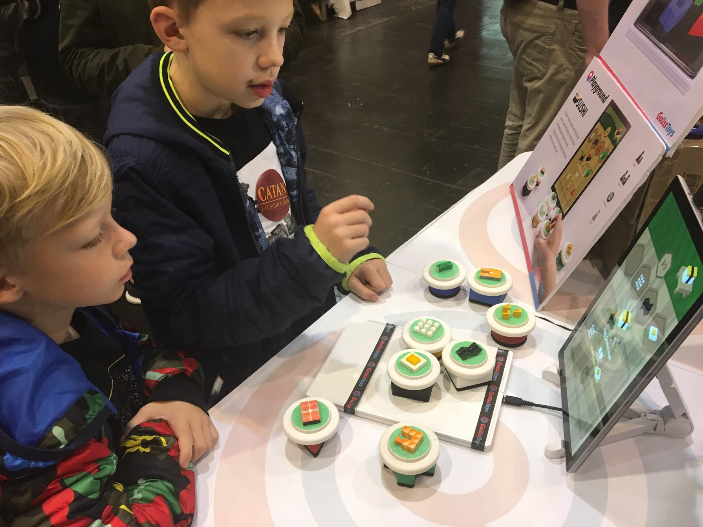

<iframe width="560" height="315" src="https://www.youtube.com/embed/gbpMIbQiMFI" frameborder="0" allow="accelerometer; autoplay; encrypted-media; gyroscope; picture-in-picture" allowfullscreen></iframe>

#### Sushi: A Cooking Game Based on GaussSense

The best way to keep sushi fresh is to serve customers’ order in time. 
Put on the designated material on the chopping board. 
Accomplish the task and go to the next level. 

-----
_This is my first independently developed game in [GaussToys Inc.](www.gausstoys.com), that I designed the process, the visual elements and writing the code._

- Developed a digital board game on tablet using GaussSense. 
- Illustrated all UI elements using Adobe Illustrator and implemented using Unity 3D.  
- Demonstrated in [Essen Spiel 2018](https://www.spiel-messe.com/en/). 
- Utilized: Unity 3D, C#, Processing, Java, Adobe Illustrator

