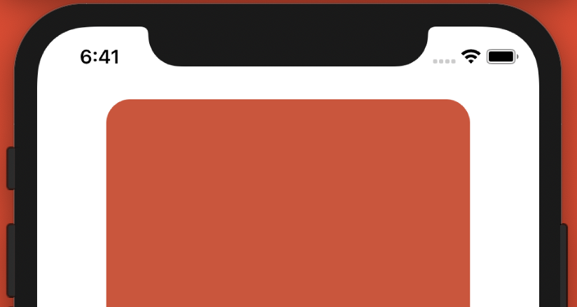

#### Lyric Display: A Tool for Displaying Projection Lyrics Using in Performance

Projected lyrics has its necessity for the audience when performing songs in foreign languages. Inspired from the redundant chores that musical club performance have to make lyric slides repeatedly. When the show is long, thousand pages of slides would takes plenty of time to proof. Plus, the staff for playing the slides can easily get lost with monotonic action. 

Accordingly, I proposed **Lyric Display** to address above issues. 

-----
_This is my first open source project, and I designed and implemented it indivisually._

- Designed a system that read pure text and display like  slides. 
- Implemented two versions on different platforms including web and standalone. 
- Utilized: HTML/CSS, JavaScript, JQuery, GIT, Unity 3D, C# 

<h3> <a href="https://github.com/lynda0214/lyricDisplay">[Lyric Display Web Version]</a>  
<a href="https://github.com/lynda0214/lyricDisplayUnity">[Lyric Display Desktop Version]</a> </h3>

