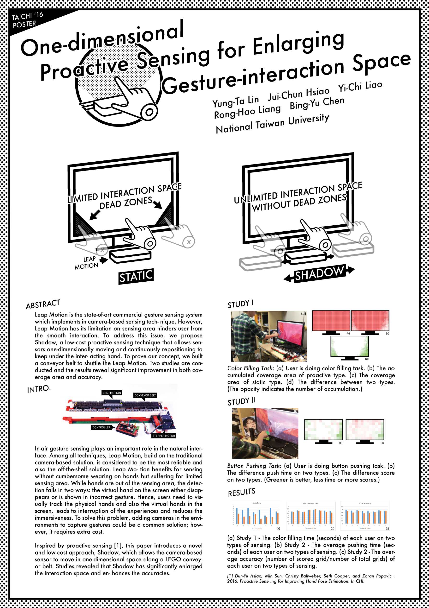

<iframe width="560" height="315" src="https://www.youtube.com/embed/cZry2HZhY2U" frameborder="0" allow="accelerometer; autoplay; encrypted-media; gyroscope; picture-in-picture" allowfullscreen></iframe>

#### Shadow: One-dimensional Proactive Sensing for Enlarging Gesture-interaction Space

**Yung-Ta Lin**, Jui-Chun Hsiao, Yi-Chi Liao, Rong-Hao Liang, Bing-Yu Chen. 2016.  
[AUI 2016 Honorable Mention](https://aui16.wordpress.com) / [TAICHI 2016 Best Poster](http://taichi2016.cs.nthu.edu.tw)

Leap Motion is the state-of-art commercial gesture sensing system which implements in camera-based sensing technique. However, Leap Motion has its limitation on sensing area hinders user from the smooth interaction. To address this issue, we propose Shadow, a low-cost proactive sensing technique that allows sensors one-dimensionally moving and continuously repositioning to keep under the interacting hand. To prove our concept, we built a conveyor belt to shuttle the Leap Motion. Two studies are con- ducted and the results reveal significant improvement in both coverage area and accuracy. 

-----
_I'm the first author. I'm resiponsible for the thesis writing, and the hardware part._

- Designed the system including hardware and software. 
- Connected Leap motion (sensor) and step motor (actuator) using Unity 3D and Arduino. 
- Prototyped this concept and Investigated it with qualitative user experiment. 
- Submitted to two conference (AUI and TAICHI), and presented in AUI 2016 (Tokyo University). 
- Utilized: Unity 3D, Leap Motion, Arduino, Research Methods, Thesis Writing, User Experience

<h3><a target="_blank" href="https://aui16.files.wordpress.com/2016/05/aui2016_paper_7.pdf">[Download This Paper]</a></h3>