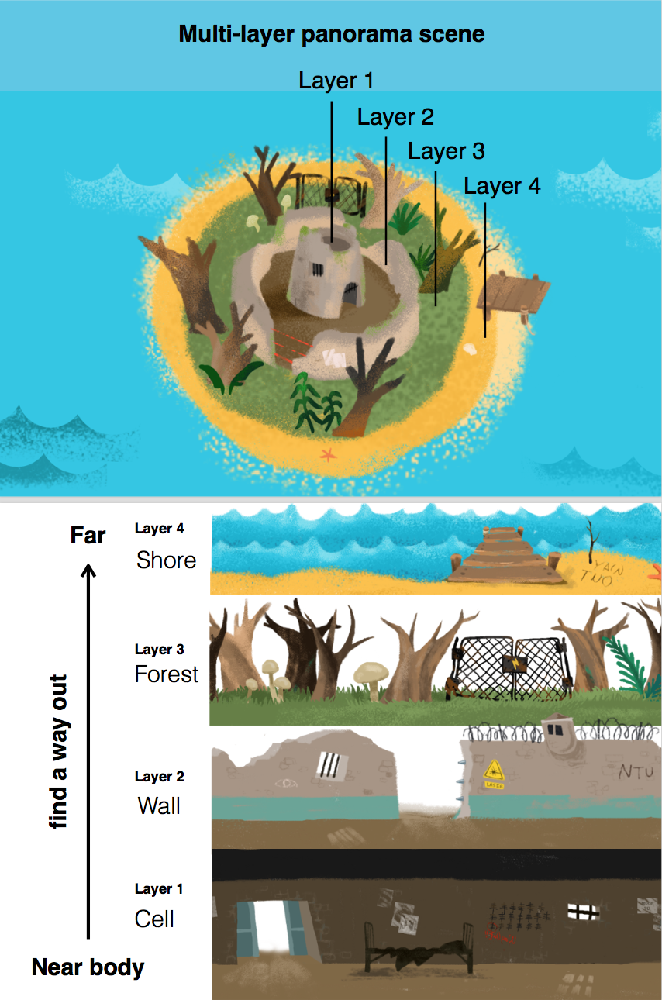
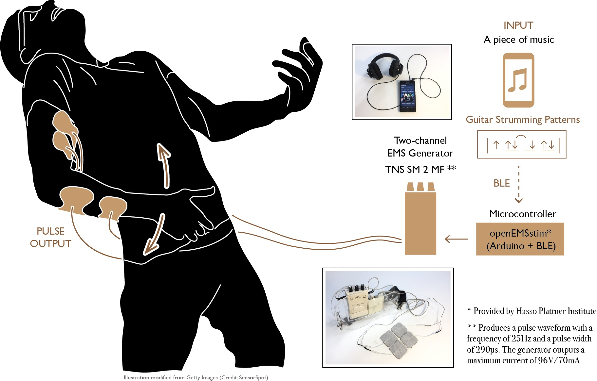
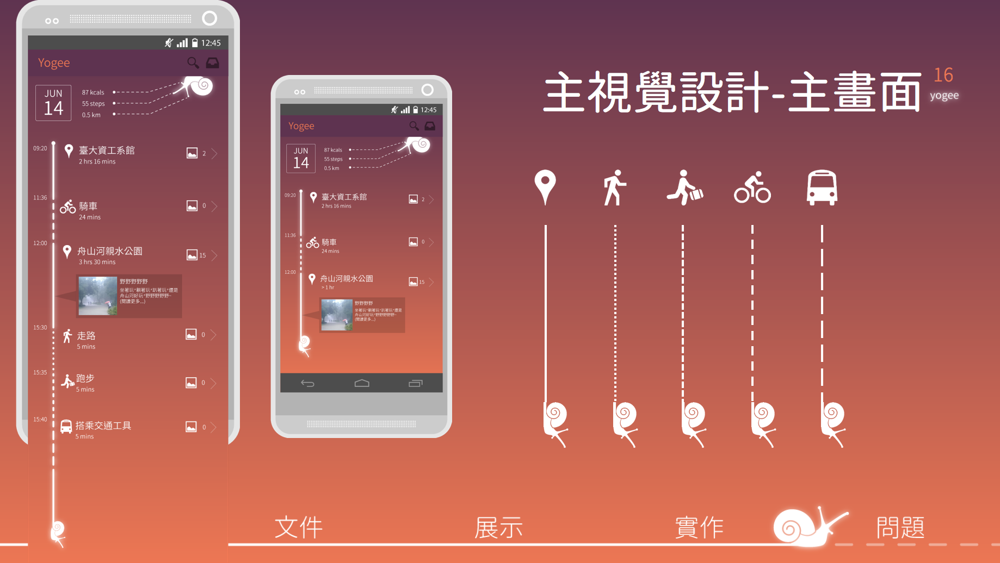
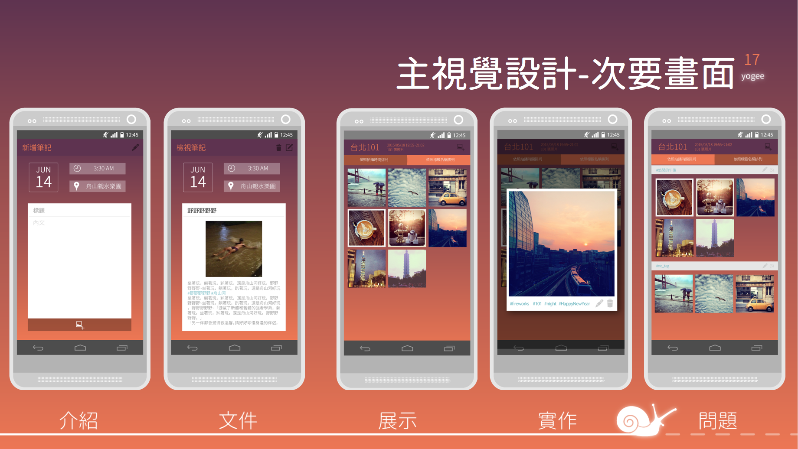

<iframe width="560" height="315" src="https://www.youtube.com/embed/_9Xy1V9iuyQ" frameborder="0" allow="accelerometer; autoplay; encrypted-media; gyroscope; picture-in-picture" allowfullscreen></iframe>

#### WayOut: A Multi-Layer Panorama Mobile Game Using Around Body Interactions Gameplay

Shan-Yuan Teng, Mu-Hsuan Chen, **Yung-Ta Lin**. 2017  
[CHI 2017: Student Game Competition](https://dl.acm.org/citation.cfm?id=3048410) Innovative Interface, Denver, CO

Thanks to motion sensors embedded in smartphones, we are able to navigate an omnidirectional panorama by moving the device around the body, as if the display is a peephole to another world. However, existing applications mainly focus on the spherical surface around the user with a constant radius, i.e., single-layer navigation. 

We present Way Out, a game allowing players to navigate multi-layer panorama scenes by around-body interactions. Way Out explores the interaction possibilities of reaching out into panorama with depth. By utilizing the front-facing camera, the system tracks the player's face and infers the distance between the user and the device based on the size of the face, thus enabling depth interactions. In this game, the player can walk through a panoramic forest maze that consists of four layers in depth and drag items in physical 3D space.

-----
_I'm in charge of the visual designs and all the illustation in the game._ 
_I also demonstrated this game in Denver, CHI 2017 conference._

- Utilized: Adobe Photoshop, Adode Illustrator
    

<iframe width="560" height="315" src="https://www.youtube.com/embed/y_U4SjE-eUI" frameborder="0" allow="accelerometer; autoplay; encrypted-media; gyroscope; picture-in-picture" allowfullscreen></iframe>

#### EMS Air Guitar: Playing Air Guitar by Electrical Muscle Stimulation

Shan-Yuan Teng, **Yung-Ta Lin**, Yi-Chi Liao. 2016.  
[UIST 2016: Student Innovation Contest ](https://uist.acm.org/uist2016/contest) **Best Implementation Award**. Tokyo, Japan.

Playing air guitar is an enjoyable way to feel the music;however, it takes some skills to be capable of. We propose “EMS Air Guitar,” an air guitar assistant using electrical muscle stimulation (EMS), which impulses the user’s arm to generate the strumming motion on the right time. We found that EMS can be an effective tool to make the air guitar easier to learn and to play. 

-----
_I'm in charge of visualization, communication between phone and computer_
_I also demonstrated this project in Tokyo, UIST 2016 conference._

- Utilized: Android Studio, Unity 3D, Blender, OSC Communication
    

<iframe width="560" height="315" src="https://www.youtube.com/embed/e7BAuHgFKwI" frameborder="0" allow="accelerometer; autoplay; encrypted-media; gyroscope; picture-in-picture" allowfullscreen></iframe>

#### Yogee: An Android app that helps you keep traveling diary

Meng Yin Chan, Jing Lin, Mei Zhi Chang, Yeh Ta Lu, Hui Jiang Yang, Yi Hsien Lyu, **Yung Ta Lin**

-----
- Collaborated with other 6 members in Design Pattern course. 
- Designed visual elements and user interfaces in Illustrator. 
- Implemented UI layouts in Android Studio. 
- Utilized: Android Studio, Java, XML, Adobe Illustrator