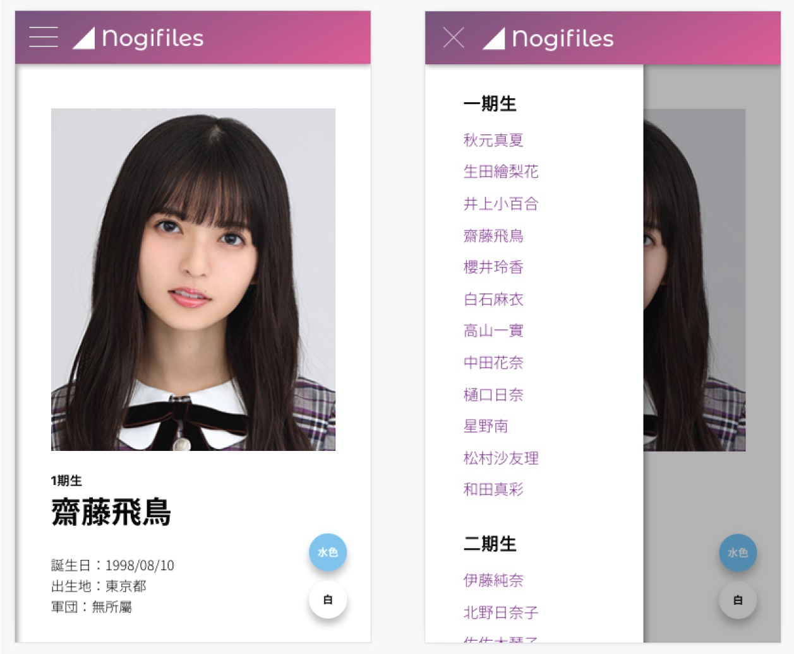

#### Nogifiles: A Tool for Quickly Looking Up Member’s Profiles of Nogizaka 46

**Yung Ta Lin**, 2019

It's an unofficial and non-profitmaking website made by a fan of Nogizaka 46. This website is especially built for mobile devices looking up basic information (including glow sticks colors). 
The profile pictures are from the [official website](http://www.nogizaka46.com/). The information is from [wikipedia](https://zh.wikipedia.org/wiki/乃木坂46) and pictures from the internet [pic1](https://www.likejapan.com/wp-content/uploads/2018/02/editors/9881/20180208012659_5a7b36e34a351.jpg) [pic2](https://overseas.weibo.com/user/NGZKMichy298/3831614465395889) Please kindly contact me if you find this infringes the copyright or any mitaken information.

-----
_I designed and implemented it indivisually._

- Built a profile look-up system especially for mobile device using react router with hash router. 
- Designed material design style UI and implemented in CSS. 
- Utilized: Javascript, React.js, React Router, HTML/CSS

<h3>
    <a target="_blank" href="https://github.com/lynda0214/nogifiles/tree/master">[Github Repository]</a>  
    <a target="_blank" href="https://lynda0214.github.io/nogifiles/">[Demo]</a>
</h3>
